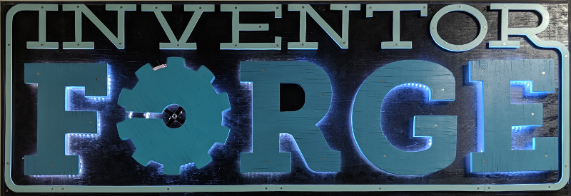

# Inventor Forge Makerspace Sign web interface
This code is a Python-Flask interface for the [Inventor Forge Makerspace](http://www.inventorforgemakerspace.org/) sign. Commands are sent via I2C to a Arduino microcontroller which is directly connected to LED strips for each letter in FORGE and a rotating gear controller.



## Requirements
Python3 (tested on Python 3.6.6)

## Installation
The following commands set up a Python3 virtual environment and install dependencies:
```
$ git clone https://github.com/cbyrd01/ifms-sign.git
$ cd ifms-sign
$ python3 -m venv venv
$ source venv/bin/activate
(venv) $ pip install -r requirements.txt
```

## Running Development
The following commands will run a development server. Please note that this is unsafe for production use.
```
$ source venv/bin/activate
(venv) $ export FLASK_APP=sign
(venv) $ export FLASK_ENV=development
(venv) $ export REDISLITE_PATH=/dev/shm/sign.rdb
(venv) $ flask run
```

## Running Production

The following command will run a production server. For automatic startup and monitoring options, see [Deploying Gunicorn](http://docs.gunicorn.org/en/stable/deploy.html)
```
$ gunicorn --worker-class eventlet -w `expr $(nproc) \* 2` sign:app
```
